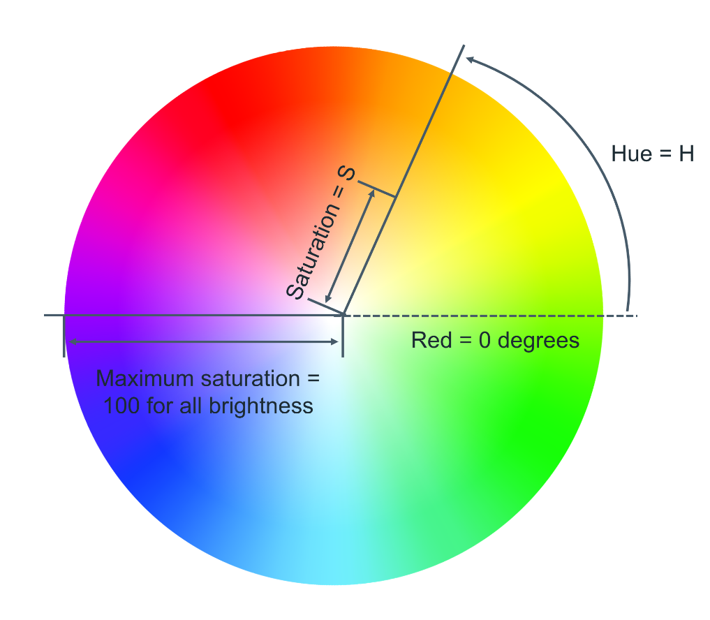

# Text and color in CSS

As you design websites, you'll be working a lot with colors and text. There are many different ways to display text and
<br>
equally as many ways to define colors.

This reading covers how text and color work in CSS.

**Color**

Colors are used in many CSS properties, for example:

```css
p { 
  color: blue; 
}
```

From CSS Version 3, there are five main ways to reference a color.
- By RGB value,
- By RGBA value,
- By HSL value,
- By hex value and
- By predefined color names.

**RGB value**

RGB is a color model that adds the colors red (R), green (G) and blue (B) together to create colors. This is based on how
<br>
the human eye sees colors.

Each value is defined as a number between `0` and `255`, representing the intensity of that color.

For example, the color red would have the RGB value of `255,0,0` since the intensity of the red color would be 100%
<br>
while blue and green would be 0%.

The color black then would be `0,0,0` and the color white `255,255,255`.

When using RGB values in CSS, they can be defined using the `rgb` keyword:

```css
p { 
  color: rgb(255, 0, 0); 
}
```

**RGBA value**

RGBA is an extension of RGB that add an alpha (A) channel. The alpha channel represents the opacity, or transparency, of the color.

Similar to RGB, this is specified in CSS using the `rgba` keyword:

```css
p { 
  color: rgba(255, 0, 0, 0.8); 
}
```

**HSL value**

HSL is a newer color model defined as Hue (H), Saturation (S) and Lightness (L). The aim of the model is to simplify
<br>
mental visualization of the color that the value represents.

Think of a rainbow that has been turned into a full circle. This represents the Hue. The Hue value is the degree value on
<br>
this circle, from 0 degrees to 360 degrees. 0 is red, 120 is green and 240 is blue.



Saturation is the distance from the center of the circle to its edge. The saturation value is represented by a percentage
<br>
from 0% to 100% where 0% is the center of the circle and 100% is its edge. For example, 0% will mean that the color is
<br>
more grey and 100% represents the full color.

Lightness is the third element of this color model. Think of it as turning the circle into a 3D cylinder where the bottom
<br>
of the cylinder is more black and toward the top is more white. Therefore, lightness is the distance from the bottom of
<br>
the cylinder to the top. Again, lightness is represented by a percentage from 0% to 100% where 0% is the bottom of the
<br>
cylinder and 100% is its top. In other words, 0% will mean that the color is more black and 100% is white.


In CSS, you use the `hsl` keyword to define a color with HSL.

```css
p { 
  color: hsl(0, 100%, 50%);
}
```

**Hex value**

Colors can be specified using a hexadecimal value. If you're unfamiliar with hexadecimal, think of it as a different
<br>
number set.

Decimal is what you use every day. Digits range from `0` to `9` before tens and hundreds are used.

Hexadecimal is similar, except it has 16 digits. This is counted as `0, 1, 2, 3, 4, 5, 6, 7, 8, 9, A, B, C, D, E, F`.

In fact, you can convert between decimal and hexadecimal. Decimal `10` is equal to hexadecimal `A`. Hexadecimal `F` is
<br>
equal to decimal `15`.

Hexadecimal can also go to tens and hundreds. For example, decimal `16` is equal to hexadecimal `10`, with `10` being the
<br>
next number after `F`.

It can be a little confusing at first but don't worry, there are plenty of converters available if you get stuck.

Colors specified using hexadecimal are prefixed with a `#` symbol followed by the RGB value in hexadecimal format.

For example, the color red which is RGB `255,0,0` would be written as hexadecimal `#FF0000`.

Again don't worry if you get stuck, there are plenty of converters available for this too!

**Predefined color names**

Modern web browsers support 140 predefined color names. These color names are for convenience purposes and can
<br>
be mapped to equivalent hex/RGB/HSL values.

Some common color names available are listed below.

```css
black
silver
gray
white
maroon
red
purple
fuchsia
green
lime
olive
yellow
navy
blue
teal
aqua
```

**Text**

With CSS there are many ways to change how text is displayed. In this section, you'll learn the most common text
<br>
manipulation CSS properties.

**Text Color**

The `color` property sets the color of text. The following CSS sets the text color for all paragraph elements to red.

```css
p { 
  color: red;
}
```

**Text Font and Size**

There are many different fonts to display text on your computer. In simple terms, a font is a collection of text characters
<br>
written in a specific style and size.

If you've used a word processor before, you're probably familiar with the fonts Times New Roman and Calibri.

To set the font used by text in CSS you use the `font-family` property.

```css
p { 
  font-family: "Courier New", monospace;
}
```

Since computers vary in what fonts they have installed, it is recommended to include several fonts when using
<br>
the `font-family` property. These are specified in a fallback order, meaning that if the first font is not available, it will
<br>
check for the second font. If the second font is not available, then it will check for the third font and so on. If none of
<br>
the fonts are available, it will use the browser's default font.

To set the size of the font, the `font-size` property is used.

```css
p { 
  font-family: "Courier New", monospace;
  font-size: 12px;
}
```

**Text Transformation**

Text transformation is useful if you want to ensure the correct capitalization of the text content. In the example below,
<br>
the CSS rule will change all text in paragraph elements to uppercase using the `text-transform` property:

```css
p { 
  text-transform: uppercase;
}
```

The most commonly used values for the `text-transform` property are:  `uppercase`,  `lowercase`,  `capitalize`
<br>
and `none`. The default value used is `none`, which means the text displays as it was written in the HTML document.

**Text Decoration**

The `text-decoration` property is useful to apply additional decoration to text such as underlining and line-through
<br>
(strikethrough).

```css
p { 
  text-decoration: underline;
}
```

It is possible to set the color, thickness and styling of the decoration too. In the example below, the underline will be a
<br>
solid red line that is 5 pixels thick.

```css
p { 
  text-decoration: underline red solid 5px;
}
```

If this is confusing, don't worry. These properties can be individually set using the `text-decoration-line`, `text-`
<br>
`decoration-color`, `text-decoration-style` and `text-decoration-thickness` properties. Let's use the
<br>
same example again and define it using the individual properties:

```css
p { 
  text-decoration-line: underline;
  text-decoration-color: red;
  text-decoration-style: solid;
  text-decoration-thickness: 5px;
}
```

The most common `text-decoration-line` values used are: `underline`, `overline`, `line-through` and `none`.
<br>
None is the default value to use no text decoration.

There are many styles available for the `text-decoration-style`  property;  `solid`,  `double`,  `dotted`,  `dashed`
<br>
and  `wavy`. The `text-decoration-style` property requires the decoration line to be defined. If the decoration style
<br>
is not specified, `solid` will be used.

# Different Types of Selectors

When styling a web page, there are many types of selectors available that allow developers to be as broad or as specific
<br>
as they need to be when selecting HTML elements to apply CSS rules to.

Here you will learn about some of the common CSS selectors that you will use as a developer.

**Element Selectors**

The element selector allows developers to select HTML elements based on their element type.

For example, if you use `p` as the selector, the rule will apply to all `p` elements on the webpage.

<i>HTML</i>
```html
<p>Once upon a time...</p>
<p>In a hidden land...</p>
```

<i>CSS</i>
```css
p { 
  color: blue; 
}
```

**ID Selectors**

The ID selector uses the id attribute of an HTML element. Since the id is unique within a webpage, 
<br>
it allows the developer to select a specific element for styling. ID selectors are prefixed with a `#` character.

<i>HTML</i>
```html
<span id="latest">New!</span>
```

<i>CSS</i>
```css
#latest { 
  background-color: purple; 
}
```

**Class Selectors**

Elements can also be selected based on the class attribute applied to them. The CSS rule has been applied to all
<br>
elements with the specified class name. The class selector is prefixed with a `.` character.

In the following example, the CSS rule applies to both elements as they have the `navigation` CSS class applied to
<br>
them.

```html
<a class="navigation">Go Back</a>
<p class="navigation">Go Forward</p>
```

```css
.navigation { 
  margin: 2px;
}
```

**Element with Class Selector**

A more specific method for selecting HTML elements is by first selecting the HTML element, then selecting the CSS
<br>
class or ID.

The example below selects all `p` elements that have the CSS class `introduction` applied to them.

<i>HHTML</i>
```html
<p class="introduction"></p>
```

<i>CSS</i>
```css
p.introduction { 
  margin: 2px;
}
```

**Descendant Selectors**

Descendant selectors are useful if you need to select HTML elements that are contained within another selector.

Let's explore an example.

You have the following HTML structure and CSS rule.

<i>HTML</i>
```html
<div id="blog">
  <h1>Latest News</h1>
  <div>
    <h1>Today's Weather</h1>
    <p>The weather will be sunny</p>
  </div>
  <p>Subscribe for more news</p>
</div>
<div>
  <h1>Archives</h
```1>
</div>

<i>CSS</i>
```css
#blog h1 {
  color: blue;
}
```

The CSS rule will select all `h1` elements that are contained within the element with the ID `blog`. The CSS rule will not
<br>
apply to the `h1` element containing the text `Archives`.

<i>CSS</i>
```css
#blog div h1 {
  color: blue;
}
```

**Child Selectors**

Child selectors are more specific than descendant selectors. They only select elements that are immediate
<br>
descendants (children) of a selector (the parent).

For example, you have the following HTML structure:

<i>HTML</i>
```html
<div id="blog">
  <h1>Latest News</h1>
  <div>
    <h1>Today's Weather</h1>
    <p>The weather will be sunny</p>
  </div>
  <p>Subscribe for more news</p>
</div>
```

If you wanted to style the `h1` element containing the text `Latest News`, you can use the following child selector:

<i>CSS</i>
```css
#blog > h1 {
  color: blue;
}
```

This will select the element with the ID `blog` (the parent), then it will select all `h1` elements that are contained directly
<br>
in that element (the children). The structure of the child selector is a CSS selector followed by the child combinator
<br>
symbol `>` followed by another CSS selector.

**Note** that this will not go beyond a single depth level. Therefore, the CSS rule will **not** be applied to the `h1` element
<br>
containing the text `Today's Weather`.

**:hover Pseudo-Class**

A special keyword called a pseudo-class allows developers to select elements based on their state. Don't worry too
<br>
much about what that means right now. For now, let's look at how the hover pseudo-class allows you to style an
<br>
element when the mouse cursor hovers over the element.

The simplest example of this is changing the color of a hyperlink when it is hovered over. To do this, you add
<br>
the `:hover` pseudo-class to the end of the selector. In the following example, adding `:hover`  to the `a` element will
<br>
change the color of the hyperlink to orange when it is hovered over.

<i>CSS</i>
```css
a:hover {
  color: orange;
}
```

This pseudo-class is very useful for creating visual effects based on user interaction.

**Other Selectors**

There are many other CSS selectors available to style your webpage.